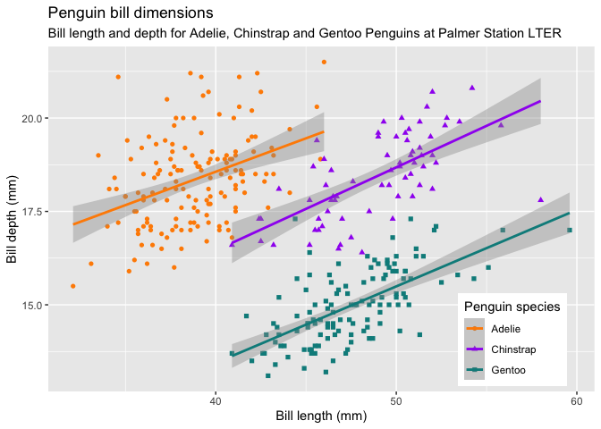

1118 Inference
================
Kaitlyn Westra
11/18/2020

``` r
library(palmerpenguins)
library(tidyverse)
```

    ## ── Attaching packages ────── tidyverse 1.3.0 ──

    ## ✓ ggplot2 3.3.2     ✓ purrr   0.3.4
    ## ✓ tibble  3.0.3     ✓ dplyr   1.0.2
    ## ✓ tidyr   1.1.0     ✓ stringr 1.4.0
    ## ✓ readr   1.3.1     ✓ forcats 0.5.0

    ## ── Conflicts ───────── tidyverse_conflicts() ──
    ## x dplyr::filter() masks stats::filter()
    ## x dplyr::lag()    masks stats::lag()

``` r
library(workflows)
library(parsnip)
library(recipes)
```

    ## 
    ## Attaching package: 'recipes'

    ## The following object is masked from 'package:stringr':
    ## 
    ##     fixed

    ## The following object is masked from 'package:stats':
    ## 
    ##     step

``` r
knitr::include_graphics("https://raw.githubusercontent.com/allisonhorst/palmerpenguins/master/man/figures/logo.png")
```


``` r
knitr::include_graphics("https://raw.githubusercontent.com/allisonhorst/palmerpenguins/master/man/figures/culmen_depth.png")
```


``` r
ggplot(penguins, aes(x = bill_length_mm, y = bill_depth_mm)) +
  geom_point() +
  geom_smooth(method = "lm") +
  labs(title = "Penguin bill dimensions", subtitle = "Palmer Station LTER", x = "Bill length (mm)", y = "Bill depth (mm)")
```

    ## `geom_smooth()` using formula 'y ~ x'

    ## Warning: Removed 2 rows containing non-finite values (stat_smooth).

    ## Warning: Removed 2 rows containing missing values (geom_point).


``` r
ggplot(penguins, aes(x = bill_length_mm, y = bill_depth_mm, color = species, shape = species)) +
  geom_point() +
  geom_smooth(method = "lm") +
  scale_color_manual(values = c("darkorange","purple","cyan4")) +
  labs(title = "Penguin bill dimensions",
       subtitle = "Bill length and depth for Adelie, Chinstrap and Gentoo Penguins at Palmer Station LTER",
       x = "Bill length (mm)",
       y = "Bill depth (mm)",
       color = "Penguin species",
       shape = "Penguin species") +
  theme(legend.position = c(0.85, 0.15),
        legend.background = element_rect(fill = "white", color = NA))
```

    ## `geom_smooth()` using formula 'y ~ x'

    ## Warning: Removed 2 rows containing non-finite values (stat_smooth).

    ## Warning: Removed 2 rows containing missing values (geom_point).



``` r
#data(ames, package = "modeldata")
ames <- AmesHousing::make_ames()
ames_all <- ames %>%
  filter(Gr_Liv_Area < 4000, Sale_Condition == "Normal") %>%
  mutate(across(where(is.integer), as.double)) %>%
  mutate(Sale_Price = Sale_Price / 1000)
rm(ames)
set.seed(10) # Seed the random number generator
ames_split <- rsample::initial_split(ames_all, prop = 2 / 3)
ames_train <- rsample::training(ames_split)
ames_test <- rsample::testing(ames_split)
```

``` r
regresion_workflow <- workflows::workflow() %>%  add_model(decision_tree(mode = "regression") %>% set_engine('rpart')) 
model <- regresion_workflow %>% 
  add_recipe(recipe(Sale_Price ~ ., data = ames_train)) %>% 
  fit(data = ames_train)
model %>% pull_workflow_fit() %>% vip::vip(num_features = 15L)
```


