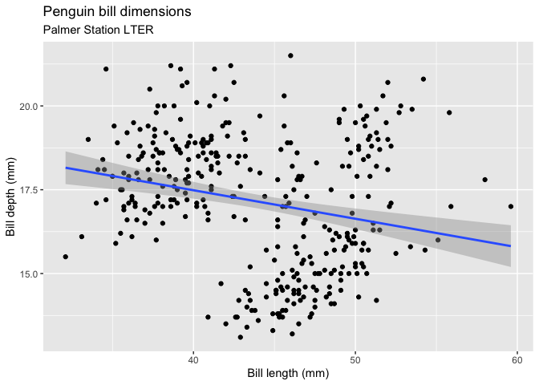
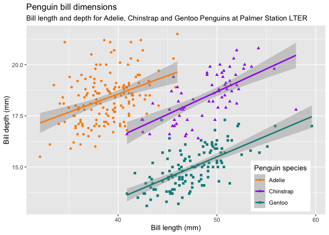
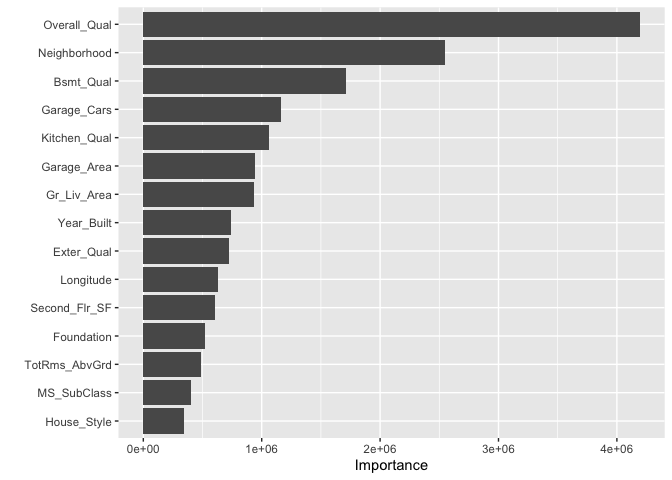
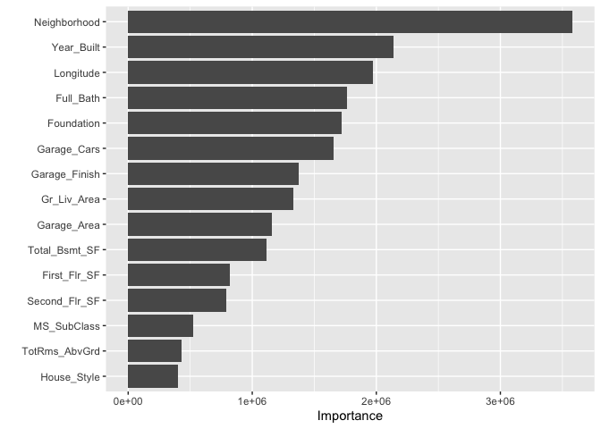

1118 Inference
================
Kaitlyn Westra
11/18/2020

``` r
library(palmerpenguins)
library(tidyverse)
library(workflows)
library(parsnip)
library(recipes)
library(rsample)
library(tidymodels)
```

Penguins
========

How does bill length relate to bill depth?
------------------------------------------

``` r
knitr::include_graphics("https://raw.githubusercontent.com/allisonhorst/palmerpenguins/master/man/figures/logo.png")
```


``` r
knitr::include_graphics("https://raw.githubusercontent.com/allisonhorst/palmerpenguins/master/man/figures/culmen_depth.png")
```


``` r
ggplot(penguins, aes(x = bill_length_mm, y = bill_depth_mm)) +
  geom_point() +
  geom_smooth(method = "lm") +
  labs(title = "Penguin bill dimensions", subtitle = "Palmer Station LTER", x = "Bill length (mm)", y = "Bill depth (mm)")
```



It looks like a negative relationship...

But when we separate by Penguin species, we see something different:

``` r
ggplot(penguins, aes(x = bill_length_mm, y = bill_depth_mm, color = species, shape = species)) +
  geom_point() +
  geom_smooth(method = "lm") +
  scale_color_manual(values = c("darkorange","purple","cyan4")) +
  labs(title = "Penguin bill dimensions",
       subtitle = "Bill length and depth for Adelie, Chinstrap and Gentoo Penguins at Palmer Station LTER",
       x = "Bill length (mm)",
       y = "Bill depth (mm)",
       color = "Penguin species",
       shape = "Penguin species") +
  theme(legend.position = c(0.85, 0.15),
        legend.background = element_rect(fill = "white", color = NA))
```



It's really a *positive* relationship! (Simpson's Paradox)

This leads us to realize that taking into account the species can drastically change our interpretation of other features... meaning **it rarely makes sense to think about one feature in isolation**.

Ames Houses
===========

``` r
#data(ames, package = "modeldata")
ames <- AmesHousing::make_ames()
ames_all <- ames %>%
  filter(Gr_Liv_Area < 4000, Sale_Condition == "Normal") %>%
  mutate(across(where(is.integer), as.double)) %>%
  mutate(Sale_Price = Sale_Price / 1000)
rm(ames)
set.seed(10) # Seed the random number generator
ames_split <- rsample::initial_split(ames_all, prop = 2 / 3)
ames_train <- rsample::training(ames_split)
ames_test <- rsample::testing(ames_split)
```

Variable Importance Plots
-------------------------

``` r
regresion_workflow <- workflows::workflow() %>%  add_model(decision_tree(mode = "regression") %>% set_engine('rpart')) 
model <- regresion_workflow %>% 
  add_recipe(recipe(Sale_Price ~ ., data = ames_train)) %>% 
  fit(data = ames_train)
model %>% pull_workflow_fit() %>% vip::vip(num_features = 15L)
```



How much does it help to have a feature in?
-------------------------------------------

``` r
set.seed(20201118)
resamples <- vfold_cv(ames_train, v = 10)

regresion_workflow %>% 
  add_recipe(recipe(Sale_Price ~ ., data = ames_train)) %>% 
  fit_resamples(resamples = resamples, metrics = metric_set(mae, rmse)) %>%
  collect_metrics() %>%
  knitr::kable()
```

| .metric | .estimator |      mean|    n|   std\_err|
|:--------|:-----------|---------:|----:|----------:|
| mae     | standard   |  25.47449|   10|  0.5586320|
| rmse    | standard   |  36.67489|   10|  0.9296087|

Without any of the Qual variables:

``` r
regresion_workflow %>% 
  add_recipe(recipe(Sale_Price ~ ., data = ames_train) %>% step_rm(ends_with("Qual"))) %>%
  fit_resamples(resamples = resamples, metrics = metric_set(mae, rmse)) %>%
  collect_metrics() %>%
  knitr::kable()
```

| .metric | .estimator |      mean|    n|   std\_err|
|:--------|:-----------|---------:|----:|----------:|
| mae     | standard   |  25.53904|   10|  0.7569299|
| rmse    | standard   |  36.68310|   10|  1.0239794|

``` r
regresion_workflow %>% 
  add_recipe(recipe(Sale_Price ~ ., data = ames_train) %>% step_rm(ends_with("Qual"))) %>%
  fit(data = ames_train) %>%
  pull_workflow_fit() %>% vip::vip(num_features = 15L)
```



When we take out the quality variables, we see that the other features get prioritized differently.
